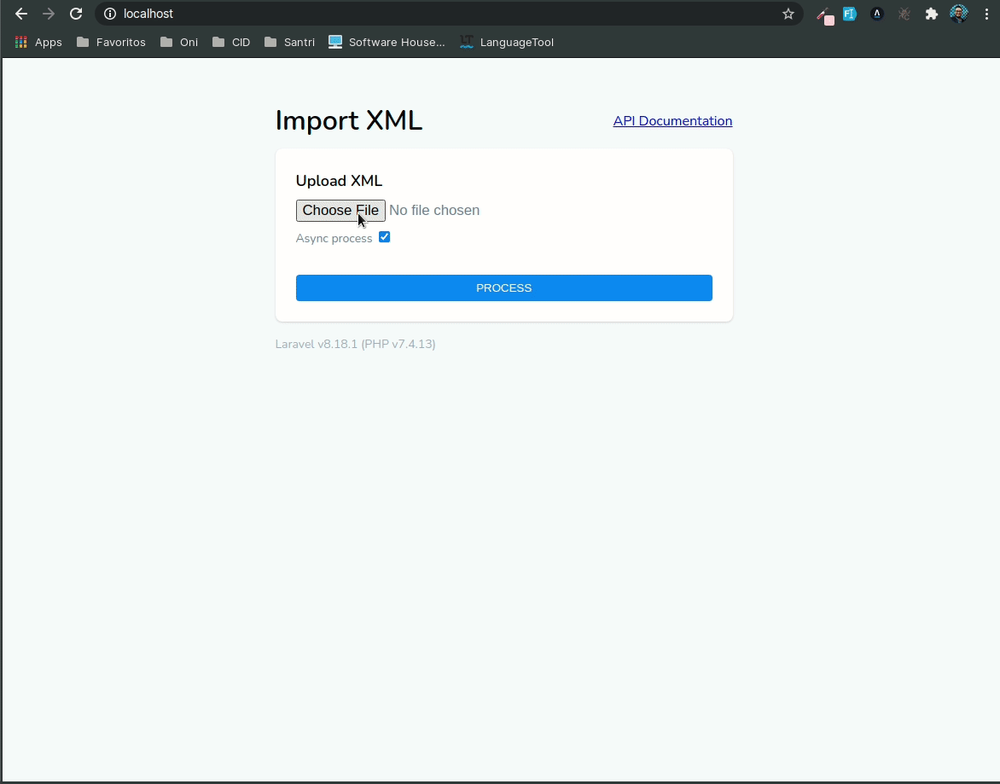
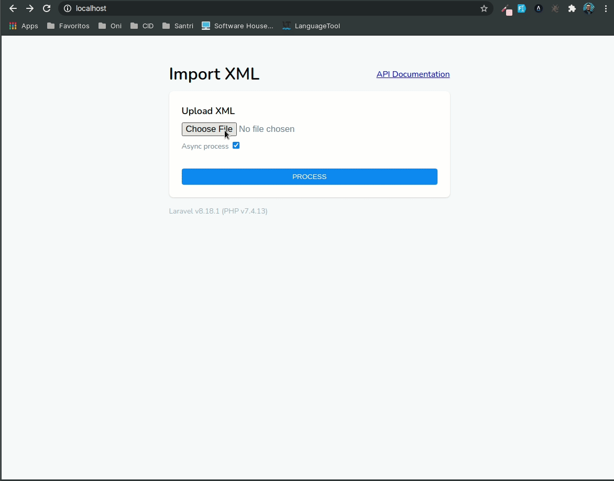
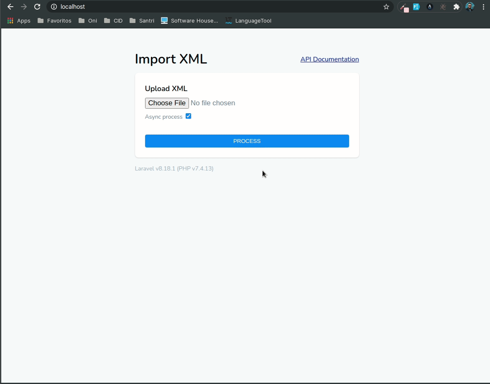
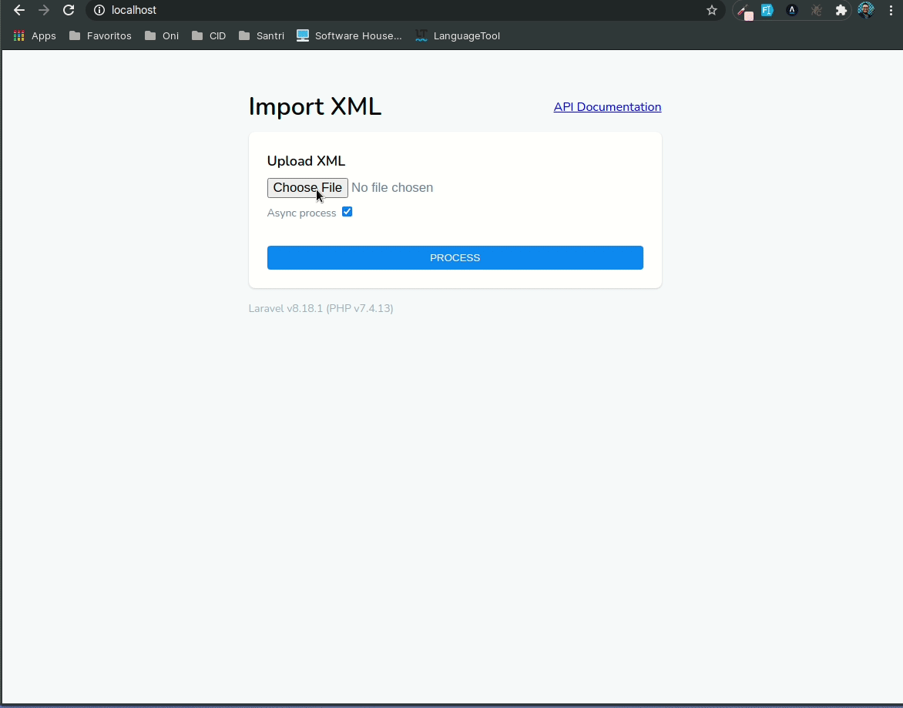

# Import XMl API

## Apresentação

Esse projeto foi desenvolvido utilizando Laravel 8 e Docker. Foi desenvolvido os seguintes recursos:

- Docker para rodar ambiente;
- MySql para banco de dados;
- Frontend para upload de arquivos XML;
- Backend utilizando padrões de projeto como Facade e Adpater;
- Job e Queue para que o upload do arquivos seja assíncrono;
- API para mostrar os resultados importados;
- Documentação da API utilizando Swagger 3;
- Autenticação da API usando Laravel Sanctum. Dados de authenticação abaixo:

```txt
email: test@test.com
password: 123
```


## Comandos para iniciar o projeto

1 - Instalar o composer

```shell
composer install
```

2 - Inicializar a docker

```shell
./vendor/bin/sail up
```

3 - Executar as migrations

```shell
docker exec -it gilson_test_app sh -c 'php artisan migrate'
```

4 - Ligar a fila de jobs (para importação assincrona)

```shell
docker exec -it gilson_test_app sh -c 'php artisan queue:work --queue=high,default'
```

## Comando para rodar os testes

```shell
docker exec -it gilson_test_app sh -c 'php artisan test'
```

## Comando para atualizar a documentação do swagger

```shell
docker exec -it gilson_test_app sh -c 'php artisan l5-swagger:generate'
```

## Algumas imagens do sistema em funcionamento








